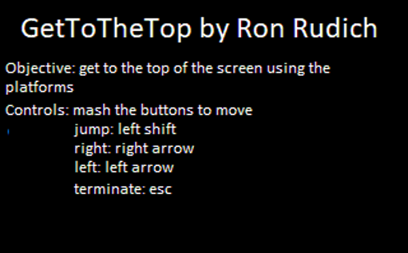
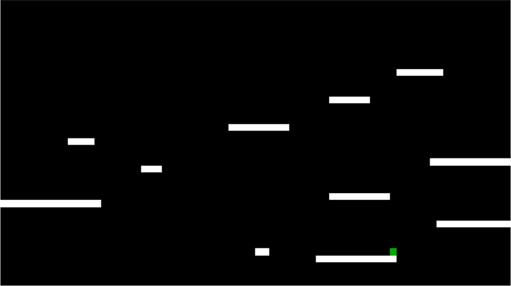

# GetToTheTop

GetToTheTop is an assembly project of a platformer game that can be used as a platformer builder to build other platformer games
## Installation

To use the program you need to use install DosBox [here](https://www.dosbox.com/download.php?main=1) and Tasm (GUI Turbo Assembler) [here](https://sourceforge.net/projects/guitasm8086/) 

then you would need to copy the Tasm files and the files from this project to C\TASM\BIN

## Usage
open DosBox (press the windowsKey then search for DosBox) than enter the following commands

```bash
mount c: c\:
c:
cd tasm
cd bin
cycles = max
tasm /zi start9.asm
tlink /v start9.obj
td start9
```
You should see the following


please pay attention to the rules and play the game accordingly

after the initial screen you should see the game screen which will look like this


I'm keeping the winning screen and what happens after a nice surprise
## Contributing
Pull requests and questions are welcome. For major changes, please open an issue first to discuss what you would like to change.

Please make sure to update tests as appropriate.

## License
[MIT](https://choosealicense.com/licenses/mit/)
